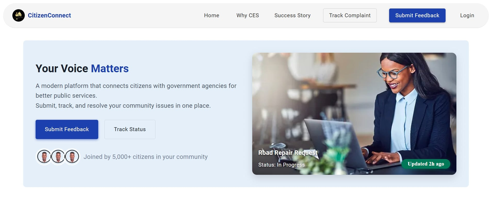
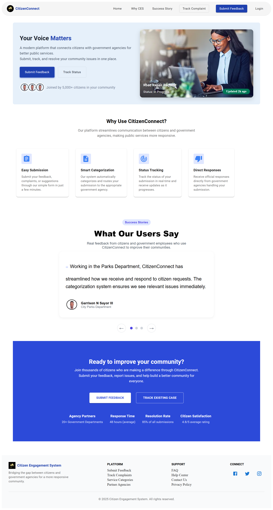
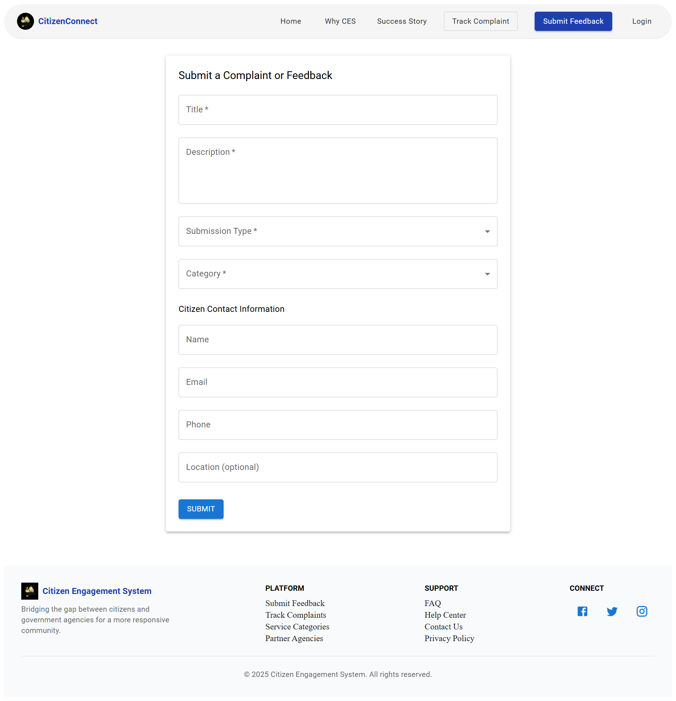
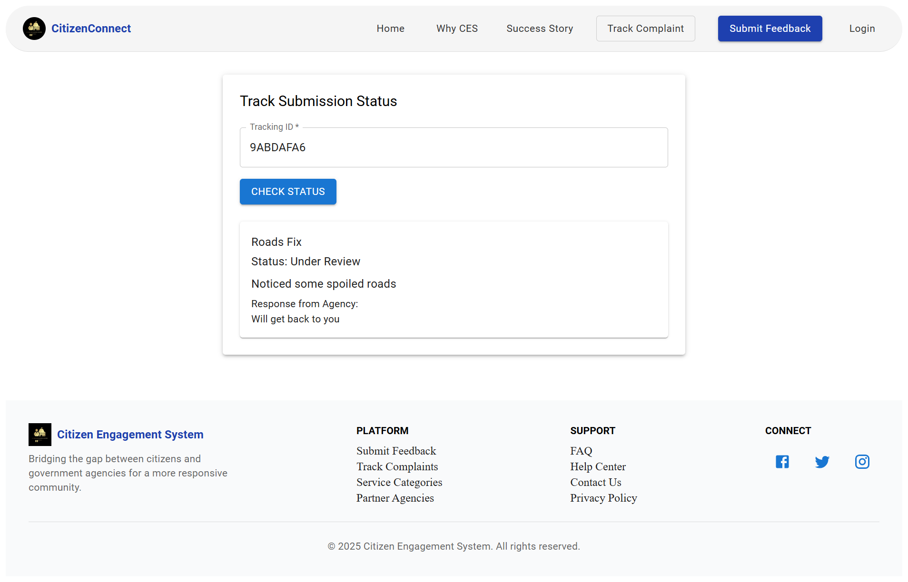
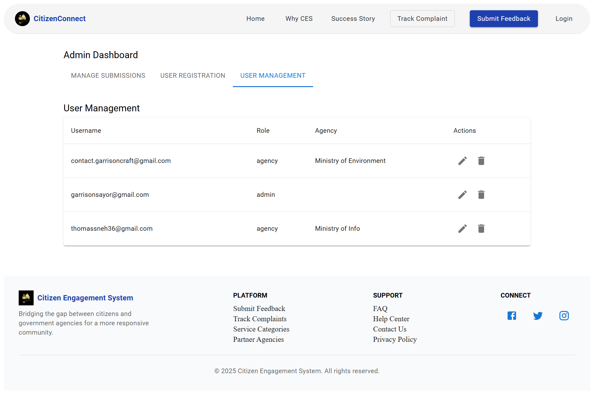

# CitizenConnect MVP

## Overview

This project is a minimum viable product (MVP) for a CitizenConnect that allows citizens to submit complaints or feedback on public services. The system supports:

- Submission of complaints/feedback via a web interface
- Categorization and routing of submissions to appropriate government agencies
- Status tracking for citizens using a tracking ID
- Simple admin interface for government agencies to respond and manage submissions

## Features

- Citizen submission form with category selection and contact information
- Backend API for managing submissions, categories, agencies, and admin authentication
- Status tracking page for citizens to check the status and agency response
- Admin dashboard for managing submissions, updating status, assigning categories and agencies, and providing public and internal responses
- Email notifications sent to agencies when a submission is assigned
- Email notifications for citizens on status updates.

## System Architecture

The CitizenConnect is structured as a modern web application with the following components:

```
[ Citizen (Web Browser) ]
            |
            v
[ React Frontend (Vite, Material-UI) ]
            |
            v
[ Node.js/Express Backend API ]
            |
            v
[ MySQL Database ]
```

- **Frontend:** Users interact via a React web app. Citizens submit complaints/feedback and track status. Admins/agencies log in for management.
- **Backend:** RESTful API built with Express handles authentication, submission routing, status updates, and email notifications.
- **Database:** MySQL stores users, submissions, categories, agencies, and status history.
- **Email Notifications:** SMTP utility sends emails to agencies (on assignment) and citizens (on status updates).

**User Roles:**
- **Citizen:** Submit and track complaints/feedback.
- **Admin/Agency:** Manage, assign, and respond to submissions via the dashboard.


## Demo & Walkthrough

## Demo Video

[][]

## Demo Pages

[]

[]

[]

[.png)]

[]

[]

### Citizen Experience

1. **Submit Feedback**
   - Go to the home page and click **"Submit Feedback"**.
   - Fill in the form: select a category, describe the issue, and provide contact info.
   - Submit to receive a unique tracking ID.

2. **Track Status**
   - Click **"Track Status"** or **"Track Complaint"** in the navbar.
   - Enter your tracking ID to view the current status and any agency/admin responses.

### Admin/Agency Experience

1. **Login**
   - Click **"Login"** in the navbar and enter admin/agency credentials.

2. **Dashboard**
   - Access the **Admin Dashboard** link (visible only to admin/agency users).
   - View all submissions, filter by category/status, assign to agencies, and update statuses.
   - Respond to citizens (public response) and add internal notes.

3. **Notifications**
   - Agencies receive email notifications when a new submission is assigned.
   - Citizens receive email updates when their submission status changes.


## Technology Stack

- Frontend: React with Material-UI, Vite build tool
- Backend: Node.js with Express, MySQL database
- Authentication: JWT for admin users
- Email: SMTP mailer utility for notifications

## Setup and Running

### Prerequisites

- Node.js (v14+)
- MySQL database
- npm or yarn package manager

### Backend Setup

1. Navigate to the `backend` directory:
   ```bash
   cd backend
   ```

2. Install dependencies:
   ```bash
   npm install
   ```

3. Configure your database connection in `.env` file.

4. Run database migrations or import schema from `schema.sql`.

5. Start the backend server:
   ```bash
   npm start
   ```

### Frontend Setup

1. Navigate to the `frontend` directory:
   ```bash
   cd frontend
   ```

2. Install dependencies:
   ```bash
   npm install
   ```

3. Start the frontend development server:
   ```bash
   npm run dev
   ```

4. Open your browser and go to the URL shown in the terminal (usually `http://localhost:5173`).

## Usage

- Citizens can submit complaints or feedback via the submission form.
- Citizens can track their submission status using the tracking ID.
- Admin users can log in to the admin dashboard to manage submissions, assign categories and agencies, update status, and respond.

## Future Improvements

- Add dashboards and analytics for admin users.
- Implement AI-assisted routing for better agency assignment.


## License

This project is open source and available under the MIT License.
